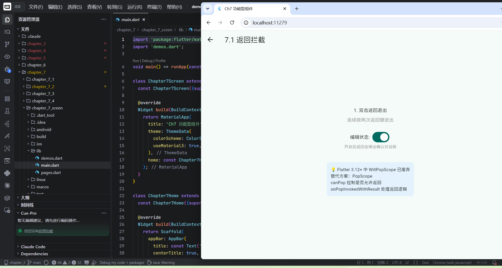
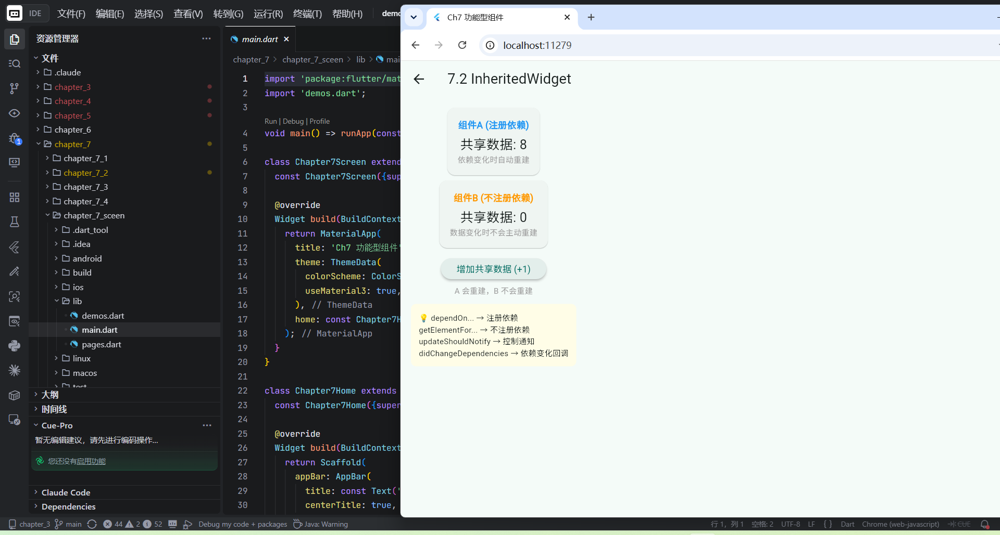
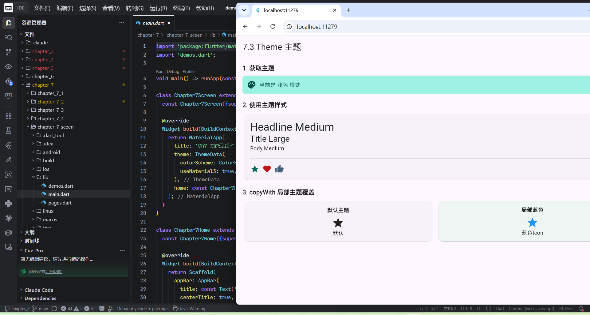
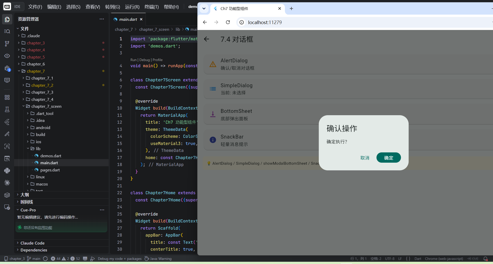

# 第7章：功能型组件 (Functional Widgets)

Flutter 功能型组件的完整示例集合，涵盖**返回拦截**（PopScope）、**跨层级数据共享**（InheritedWidget）、**主题系统**（Theme）和**对话框体系**（Dialog / BottomSheet / SnackBar）。

---

## 7.1 导航返回拦截 — PopScope

> ⚠️ Flutter 3.12+ 中 `WillPopScope` 已废弃，替代方案：`PopScope`

**两种经典场景**：① 双击返回退出（防误触）② 编辑状态下拦截返回（需确认）

<p align="center">
  
</p>

**核心代码** → [chapter_7_1/lib/willpop_scope_demo.dart](chapter_7_1/lib/willpop_scope_demo.dart)

```dart
PopScope(
  canPop: !_isEditing,  // false = 阻止直接返回
  onPopInvokedWithResult: (didPop, result) async {
    if (didPop) return;  // 已经 pop 了，无需处理

    // 场景1：编辑中 → 弹确认对话框
    if (_isEditing) {
      final ok = await showDialog<bool>(...);
      if (ok == true && mounted) Navigator.of(context).pop();
      return;
    }

    // 场景2：双击退出 → 2秒内再按才退出
    if (_lastPressedAt == null ||
        DateTime.now().difference(_lastPressedAt!) > Duration(seconds: 2)) {
      _lastPressedAt = DateTime.now();
      ScaffoldMessenger.of(context).showSnackBar(
        SnackBar(content: Text('再按一次退出')),
      );
      return;
    }
    Navigator.of(context).pop();
  },
  child: Scaffold(...),
)
```

| PopScope 属性 | 说明 |
|---|---|
| `canPop` | `false` 阻止返回；`true` 允许（但仍会触发回调） |
| `onPopInvokedWithResult` | 收到返回命令时触发，`didPop=true` 表示已成功 pop |
| `didPop` 参数 | 用于判断是否已被系统处理，避免重复操作 |

---

## 7.2 InheritedWidget — 跨层级数据共享

InheritedWidget 是 Flutter **数据向下传递**的核心机制，Theme、MediaQuery、Navigator 都基于它实现。

<p align="center">
  
</p>

**核心代码** → [chapter_7_2/lib/inherited_widget_demo.dart](chapter_7_2/lib/inherited_widget_demo.dart)

```dart
// ① 定义 InheritedWidget
class _ShareDataWidget extends InheritedWidget {
  final int data;
  final VoidCallback onIncrement;

  const _ShareDataWidget({
    required this.data,
    required this.onIncrement,
    required super.child,
  });

  // 核心方法：子组件通过它获取共享数据（注册依赖）
  static _ShareDataWidget of(BuildContext context) {
    return context.dependOnInheritedWidgetOfExactType<_ShareDataWidget>()!;
  }

  // 控制何时通知依赖方重建
  @override
  bool updateShouldNotify(_ShareDataWidget old) => old.data != data;
}

// ② 在顶层注入数据
_ShareDataWidget(
  data: _data,
  onIncrement: () => setState(() => _data++),
  child: Column(children: [
    _DataDisplay(),         // 组件A：会随数据变化重建
    _DataDisplayNoDepend(), // 组件B：不会自动重建
    _DataUpdateButton(),    // 按钮：触发数据变化
  ]),
)

// ③ 子组件 A：注册依赖 → 数据变化时自动重建
final d = _ShareDataWidget.of(context).data; // dependOn... → 注册依赖

// ④ 子组件 B：不注册依赖 → 不会自动重建
final el = context.getElementForInheritedWidgetOfExactType<_ShareDataWidget>();
final d = (el?.widget as _ShareDataWidget?)?.data; // getElementFor... → 不注册
```

### 关键 API 对比

| 方法 | 是否注册依赖 | 数据变化后 |
|---|---|---|
| `dependOnInheritedWidgetOfExactType<T>()` | ✅ 是 | 子树自动重建 |
| `getElementForInheritedWidgetOfExactType<T>()` | ❌ 否 | 不会自动重建 |

> 💡 Provider 库其实就是对 InheritedWidget 的封装，理解了它也就理解了 Provider 的底层原理。

---

## 7.3 Theme — 主题系统

Theme 组件内部通过 **InheritedWidget** 向下共享样式数据，子组件通过 `Theme.of(context)` 获取。

<p align="center">
  
</p>

**核心代码** → [chapter_7_3/lib/theme_demo.dart](chapter_7_3/lib/theme_demo.dart)

```dart
// ① 全局主题：MaterialApp 级别
MaterialApp(
  theme: _dark ? ThemeData.dark() : ThemeData.light(),
  home: Scaffold(...),
)

// ② 获取主题数据
Theme.of(context).colorScheme.primaryContainer         // 颜色方案
Theme.of(context).textTheme.headlineMedium              // 文本主题
Theme.of(context).colorScheme.primary                   // 主色
Theme.of(context).colorScheme.error                     // 错误色

// ③ 局部主题覆盖：Theme + copyWith
Theme(
  data: Theme.of(context).copyWith(
    iconTheme: IconThemeData(color: Colors.blue, size: 40),
  ),
  child: Column(children: [...]),  // 子树内图标全部变蓝
)
```

### ThemeData 常用属性

| 属性 | 作用 |
|---|---|
| `primaryColor` | 主色 |
| `colorScheme` | Material 3 颜色方案 |
| `textTheme` | 全套文本样式 |
| `iconTheme` | 图标默认样式 |
| `appBarTheme` | AppBar 主题 |
| `cardTheme` | 卡片主题 |
| `inputDecorationTheme` | 输入框装饰主题 |

> 💡 `copyWith()` 是关键：在不改变全局主题的前提下，临时修改子树样式。

---

## 7.4 对话框体系

Flutter 提供了完整的对话框生态：AlertDialog、SimpleDialog、BottomSheet、SnackBar。

<p align="center">
  
</p>

**核心代码** → [chapter_7_4/lib/dialogs_demo.dart](chapter_7_4/lib/dialogs_demo.dart)

```dart
// ① AlertDialog：确认/取消对话框
final result = await showDialog<bool>(
  context: context,
  builder: (ctx) => AlertDialog(
    title: Text('确认操作'),
    content: Text('确定执行？'),
    actions: [
      TextButton(onPressed: () => Navigator.pop(ctx, false), child: Text('取消')),
      FilledButton(onPressed: () => Navigator.pop(ctx, true), child: Text('确定')),
    ],
  ),
);
// result = true / false / null（点击外部关闭）

// ② SimpleDialog：选项列表
final result = await showDialog<String>(
  context: context,
  builder: (ctx) => SimpleDialog(
    title: Text('请选择'),
    children: [
      SimpleDialogOption(onPressed: () => Navigator.pop(ctx, 'A'), child: Text('选项A')),
      SimpleDialogOption(onPressed: () => Navigator.pop(ctx, 'B'), child: Text('选项B')),
    ],
  ),
);

// ③ ModalBottomSheet：底部弹出面板
showModalBottomSheet(
  context: context,
  shape: RoundedRectangleBorder(
    borderRadius: BorderRadius.vertical(top: Radius.circular(16)),
  ),
  builder: (ctx) => Padding(
    padding: EdgeInsets.all(16),
    child: Column(
      mainAxisSize: MainAxisSize.min,
      children: [
        ListTile(leading: Icon(Icons.wechat), title: Text('微信'), onTap: () => Navigator.pop(ctx)),
        ListTile(leading: Icon(Icons.email), title: Text('邮件'), onTap: () => Navigator.pop(ctx)),
      ],
    ),
  ),
);

// ④ SnackBar：轻量消息提示
ScaffoldMessenger.of(context).showSnackBar(
  SnackBar(
    content: Text('操作成功'),
    duration: Duration(seconds: 2),
    action: SnackBarAction(label: '知道了', onPressed: () {}),
  ),
);
```

### 对话框类型对比

| 类型 | API | 特性 |
|---|---|---|
| AlertDialog | `showDialog<bool>` | 确认/取消，返回 bool |
| SimpleDialog | `showDialog<String>` | 选项列表，返回选项值 |
| 自定义 Dialog | `showDialog` + 任意 Widget | 可嵌入 TextField 等任意内容 |
| ModalBottomSheet | `showModalBottomSheet` | 从底部滑入 |
| SnackBar | `ScaffoldMessenger.showSnackBar` | 轻量，底部浮层自动消失 |
| DatePicker | `showDatePicker` | 日期选择 |
| TimePicker | `showTimePicker` | 时间选择 |

> 💡 所有对话框都通过 `Navigator.pop(ctx, result)` 返回数据，这是 Navigator 栈管理思想的延续。

---

## 核心知识脉络

```
PopScope (导航守卫)
    └─ canPop + onPopInvokedWithResult
    └─ 双向绑定：用户操作 → Flutter 回调 → 开发者决策

InheritedWidget (数据共享)
    └─ dependOn... → 注册依赖 → 自动重建
    └─ getElementFor... → 仅读取 → 不重建
    └─ updateShouldNotify → 控制通知
    └─ 是 Theme / Provider 的底层基石

Theme (主题)
    └─ MaterialApp.theme → 全局
    └─ Theme.of(context) → 读取
    └─ Theme + copyWith → 局部覆盖
    └─ 底层 = InheritedWidget

Dialog 体系
    └─ showDialog → AlertDialog / SimpleDialog / 自定义
    └─ showModalBottomSheet → 底部面板
    └─ ScaffoldMessenger.showSnackBar → 轻量提示
    └─ 返回值通过 Navigator.pop(ctx, result)
```

## 核心心智模型

| 概念 | 说明 |
|---|---|
| **PopScope** | Flutter 3.12+ 的导航守卫，替代已废弃的 WillPopScope |
| **InheritedWidget** | 向下传递数据的唯一 Flutter 原生机制；Provider 的底层 |
| **依赖注册** | `dependOn...` = 订阅；`getElementFor...` = 快照 |
| **copyWith** | 不可变数据结构的增量修改 — Flutter 主题系统的核心模式 |
| **Navigator.pop 返回值** | 所有弹窗/对话框通过 Navigator.pop 传递结果 |

## 项目结构

```
chapter_7/
├── chapter_7_1/lib/   ← PopScope 返回拦截示例
├── chapter_7_2/lib/   ← InheritedWidget 数据共享示例
├── chapter_7_3/lib/   ← Theme 主题系统示例
├── chapter_7_4/lib/   ← Dialog / BottomSheet / SnackBar 示例
└── chapter_7_sceen/lib/ ← 汇总演示（含全部子章节导航）
```

## 运行方式

```bash
# 运行某个子章节
cd chapter_7/chapter_7_2 && flutter run

# 运行汇总演示
cd chapter_7/chapter_7_sceen && flutter run
```
